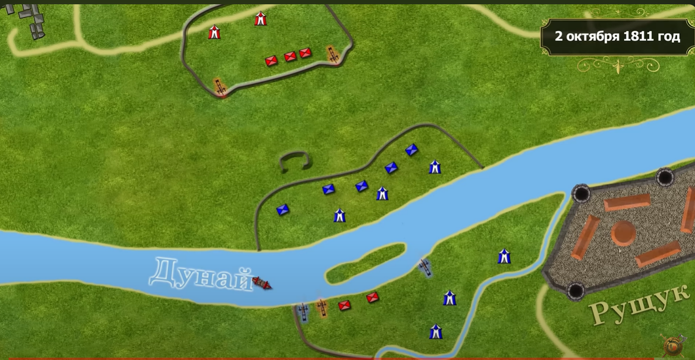
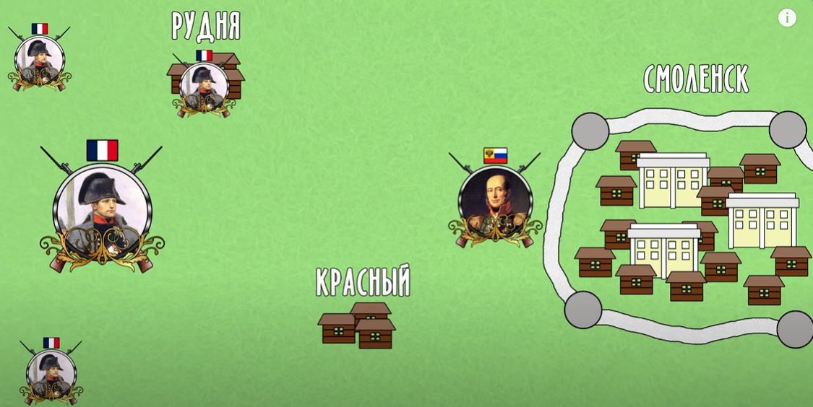
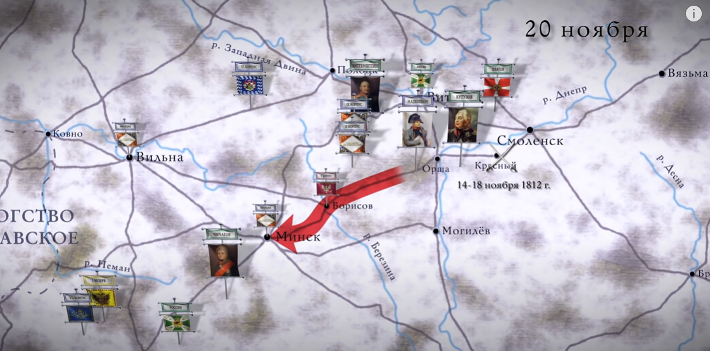
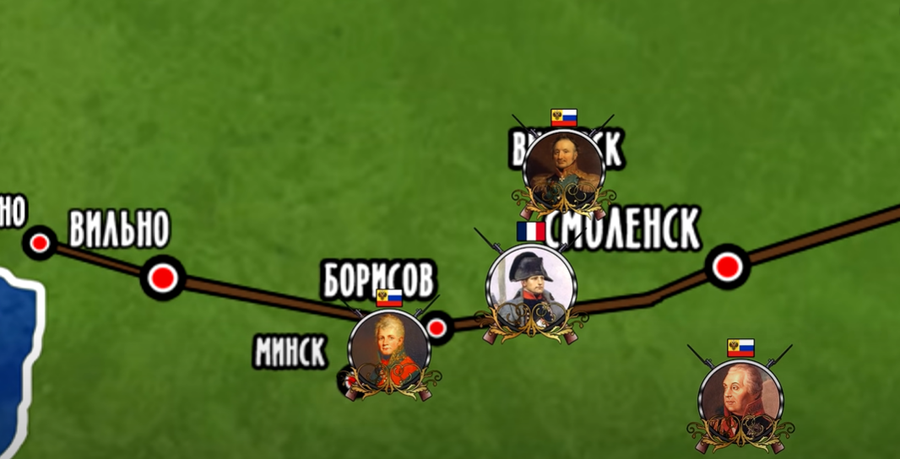
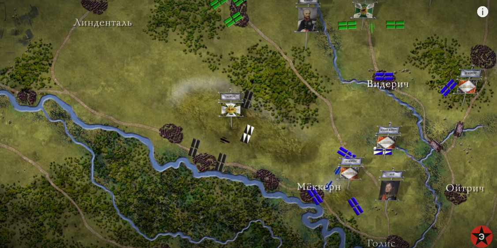
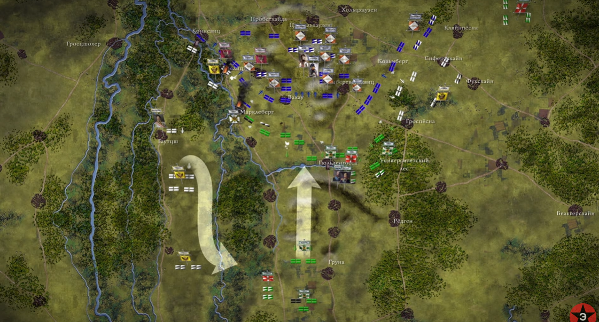
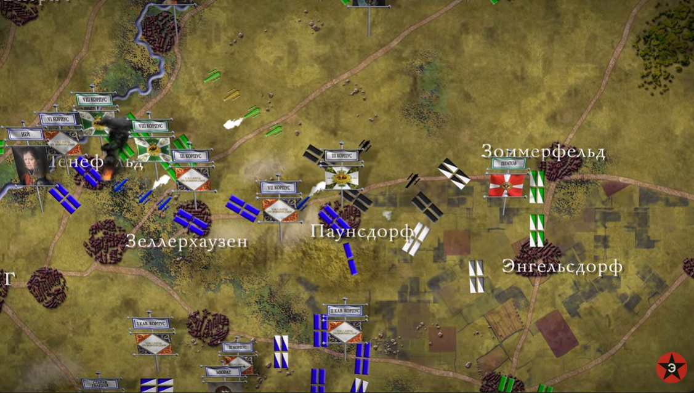
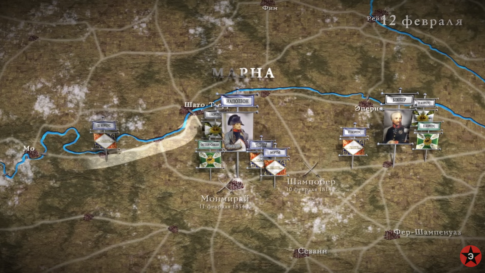

Война 3 коалиции

Россия обязуется выстовить 115 000 солдат
а Англия выплатить 1 250 000 фунтов за 100 000 солдат

Битва при Трафальгаре

Ульмская кампания

Битва при Аустерлице

| страна                    | сила   | убиты           | раннены | пленные         |
|---------------------------|--------|-----------------|---------|-----------------|
| Франция                   | 75 000 | 1288            | 6991    | 573             |
| Коалиция Австрия и Россия | 89 000 | 15 000 - 16 000 |         | 12 000 - 20 000 |

Итог Австрия вышла из войны 

Война 4 коалиции 
состав Англия Пруссия Россия Швеция 

неразумное решение короля Пруссии начать наступление без поддершки союзников привело к битве при Йене-Аурштате

Битва при Йене

| страна  | сила   | потери          |
|---------|--------|-----------------|
| Пруссия | 55 000 | 25 000 - 26 000 |
| Франция | 40 000 | 5 000 - 6 000   |

Битва при Ауэрштате

| страна  | сила   | потери          |
|---------|--------|-----------------|
| Пруссия | 64 000 | 13 000 - 15 000 |
| Франция | 26 000 | 7052 - 7100     |

катастрофическое поражение Пруссии и потери до 41 000 солдат 

последующия кампания была катастрофой всего за 19 дней пруссия фактически выведина из войны 150 000 пленных 65 000 убитых 4 000 орудий и 100 000 мушкетов из запаса в Берлине потери наполеона 15 000 

Наполеон пошёл на Восток 

армия России пошла на Бернадота а Наполеон контатаковал на север Беннексену(Генерал России) пришлось отцтупить на север к Эйлау

Битва при Прейсиш-Эйлау

Битва 

Наполеон обладал лишь 45 000 солдат расчитовал наприход Даву с 15 000 солдат и идиальной позицией для атаки на Беннексена

Началась Самая Большая Артилерийская дуэль в Мире на тот момент и длилась она 3 часа

Когда авангард Даву атаковал он однако потерял 1 500 олдат и был отброшен

Это очень встревожило Наполеона который расчитовал с помошью Даву окружить Беннексена теперь Беннексен мог убежать

Беннексен однако не ушёл

Наполеон решил вместо того что атаковать с фланга пойти с центра и отдал приказ дивизии сент-илера и Ожеро и его 7 корпусу атаковать 

однако из-за метели 7 корпус отклонился и пошёл на орудия Беннексена

Лошадь Ожеро была убита под ним и он сам был тяжело раннен

целые полки были уничтожены всего за 30 минут 5 000 солдат 7 корпуса были убиты

Наполеон послал Мюрата с 40 эскадронами кавалерии (5 000 солдат)

Мюрат нашёл брешь в обороне и атаковал туда 

кирасиры Мюрата дошли до штаба Беннексена но были обстреленны оттуда

когда началась Русская контратака Мюрат приказал отойти но не успел русские загарадили ему путь но он послал луших кирасиров европы и прорвался

Даву теперь прибол в полном составе

Баггвут оттошёл на крегскую гору а дивизии сент-илера и 3 корпус Даву атаковали её 

Беннексен бросил свой последний резерв 14 дивизию она была остововленна

к 15 00 Даву возобновил атаку и захватил крегскую гору он также захватил штаб Беннексена

для победы требоволся последний рывок

но пришли Пруссаки

дело в том что роно утром Беннексен отправил 70 летнему Антону фон Лестоку приказ подойти к Эйлау

6 корпус Нея должен был сдержать Лестока но не успел

Лесток атаковал Даву и захватил бывший штаб Беннексена в Ауклаппене 

но из-за плохой координации атаки Лестока не привели к захвату крегской горы

около 17 30 6 корпус Нея (14 000) пришёл туда откула 1 час назад пришёл Лесток (с севера)

теперь Беннексен был зажат с севера Неям и с юга Даву 

Армия Беннексена составлялала 52 000 - 41 000 а Наполеона 60 000 - 45 000

Беннексен отцтупил с поля боя

Битва была прозвана резня в снегу (потери 30 000 - 55 000)

| страна  | сила                          | орудия                     | потери          |
|---------|-------------------------------|----------------------------|-----------------|
| Россия  | 67 000                        | 400                        | 15 000 - 26 000 |
| Франция | 45 000 Наполеон 15 000 Даву   | 300 - 137 Наполеон 36 Даву | 15 000 - 29 643 |
| Пруссия | 8 500 - 9 000                 | н/д                        |  н/д            |

Армия Наполеона в Пруссии(всего)190 000

Армия России  119 000 

Беннексен отошёл не на север к Кёнигсбергу как думал Наполеон а на восток на восточной берег реки Алле

около Фридланда он переправилься на западный берег

корпус Ланна 16 000 солдат заметил Беннексена и отправил гонца Наполеону и Наполеон пришёл

уваров атаковал на северном фланге на груши но он проиграл

на юге левоё крыло армии багратиона сражалось с удино 

на юге армия багратиона атаковала удино из-за этова очень малая часть была незанята

Ней зазбил левый фланг багратиона 

Виктор также разбил авангард багратиона его остановила лишь Императорская гврардия Россия

за зазгромом левого фланга последовала атака

пушечный огонь привёл к тому что мосты были созжины

паника охватила Русских

| страна  | сила   | потери          |
|---------|--------|-----------------|
| Россия  | 60 000 | 20 000 - 40 000 |
| Франция | 80 000 | 8 000 - 10 000  |

Тильзитский мир
- Россия присоединилась к контенетальной блокаде
- Пруссия лешилась большей части терретории: польши и вестфалии и данцига
- Швеция не участвуют на мире
- Россия отдаёт ионические острава

Война со Швецией 1808 -1809

Повод :

Швеция не блокирует Англию

Англия платит 1 000 000 фунтов за 1 месяц войны

В Марте руские заняли хельсенки

а уже в мая захватила Свеаборг

однако на севере Россия терпет ряд порожений несёт осчутимые потери

Финны образуют партизанские отряды и нападают на руских

перелом последовал в сентябре русские победили в битве при Оравайсе а затем в битве при гельзинге

в октябре Шведы снова победили при Иденсальнами но закрепить успех не смогли

к ноябрю русские заняли всю финляндию

Мир 
- Финляндия и Аландские острава перешли к России
- Швеция перешла в контенентальную армию

Русско-Персидская война

Александр 1 аннексировал Картле-Кахетиское Царство но не него совершали набеги гянженские ханы и Павел Цицанов атаковал его Гянженское ханство была аннексировано 

это не понравилась шаху персии погибший при осаде гянжийский хан Джават-хан это его родственник

Цицианов потребовал Ереванскому ханству поставить своего кодидата на звания главы армянской церкви также платить 80 000 рублей

однако Ереванское ханство было вассалом Персии

начало войны

этап 1 цицианов остановление персов (1804 - 1805)

этап 2 тормасов захват азербайжана  (1809)

этап 3 котляревский разгром персов при Асландузе и взял крепость Ленкораль

Битва при асландузе

| страна | сила                       | орудия | фальконетки | потери         |
|--------|----------------------------|--------|-------------|----------------|
| Персия | 14 000                     | 14     | 30          | 2 000 - 10 000 |
| Россия | 1 422 пехота 485 кавалерия | 5      | 0           | 127            |

Русско-Турецкая Война 1806 - 1812

По условиям Ясского мира Валахия и Молдова были Вассалами Османской Империи но Султан не мог сместить правителей этих княжеств

однако в 1806 году султан смесьтил их

40 000 Русских  легко захватили Дунайские княжества и блокировали дарданеллы с моря

произошёл бунт Янычары свегли Силима 3 Султаном стал Мустафа 4

он попытался прорвать блокаду дардалел попытка провалилась 

Визирь пошёл на Бухерест порожение турок

Георгий Карагоргиоевич возглавил восстание против Оссман в Сербии

Мустафа заключил перемирие с России

генерала Празоровского

переворот в Османской Империи султаном стал Махмуд 2

Возобновленния войны

Визирь снова идёт в Валахию но Багратон атаковал Силистрию и Визирь пошёл на Силистрию Багратион ушёл

Командующим стал Каменский

План Каменсккого

часть на помоь Сербии

осады Силистрии и Рущика
Главний удар на Шумлу

он взял Силистрию

но не взял Шумлу

он осадил Рущук но потом он пошёл на Батин

Битва при Батине

|  | сила   |  потери         |
|--|--------|-----------------|
|  | 30 000 | 10 000 - 20 000 |
|  | 21 000 | 1542            |

в результате он взял Никополь Плевну Турно Ловчу Сельви

Каменского снимают потому что он считал нужном продолжать атаковать на Балканах А Александр 1 считалчто нада содредоточить Войска на фронте с Наполеоном

Командующим стал Кутузов и у него отняли 50 000 солдат и у него осталось 45 000 солдат

Турки сосредоточили 70 000 солдат и завладели Никополем и др гордами

Сулан решил занят Рущюк и Бухарест

Битва при Слабодзее

| страна            | силы   | орудия | потери                                |
|-------------------|--------|--------|---------------------------------------|
| Россия            | 25 000 | 38     | н / д                                 |
| Османская Империя | 56 000 | 50     | 20 000 убиты и раннены 12 000 пленные |

мир
- Бессарабия перешла к Россия

Отечесвенная Вона 1812

Контенентальная блокада была для России невыгыдной

Дипломатия перед Войной

Наполеон перлогает женится на сестре Алексанадре Алесандр отказал 

Алексадр писал своей матери что надо собирать армию

Бернадот(принц Швеции) занял сторону России ибо она предложила Норвегию

Наполеон думал что войну начнёт Россия

Наполеон хотел

- выполнение союзный обязательсв (болкады)
- Совместный поход на Индию

24 июня Наполеон перешёл через Неман

Наполеон расчитовал на Битва при Вильно но Барклай де Толе ушёл в Дриссуно Дрисса оказалась непригодна для обороны и ушёл дальше к Полоцку

Багратион

Багратион был окружён войками Жерома Бонапарта но он прорвася Даву снова окружил его под Минском он срова прорвался Даву снова пригродил ему путь на Могилёв

Маршал Макдональд пошёл на Север

но российский генерал Эссен сжёг придмемстье Риги и укрепился 

а Макдональд остановился в ожидании подкрепленний Удино 

Удино занял Полоцк и двигался в сторону Риги но генерал Витгенштейн атаковал его Удино попытался обойти его с севера но он не смог

с тех пор на северном направление похода не придпринимались активные боевые действия

Барклай и Багратион хотели соединиться в Смоленске

Багратион решил перети через днепор

просто так форсировать днепор нельзя так как Даву мешал ему

Багратион сделал вид что идёт на Моглёв

и сам переправился через днепр

Наполеон был взбешён а Жером обидевшесь уехал

Наполеон ожидал боя под Витебском а Барклай иммирировал наступленние и отцтупил на Смоленнеск

23 июля 1812 года Армии Барклая и Багратиона соеденились под Смоленском

Южный фронт

на юге Австрийцы прикрывали Француский корпус Ренье который должен был догонять Багратиона но русские Тормасого остоновили их хотя Австрийцы пришли на помощь но активных действий не придпринемали

Битва под Смоленском

Находясь в Смоленске Барклай хотел дальше отцтупать но генерал говорили что позади Москва

Барклай атаковал Рудню 

Наполеон был умён и решил атаковать Красный и зайти в тыл к русским

генерал Неверовский прикрыл Барклая под Красным и задержал Наполеона Барклай отцтуыпил

Наполеон с 180 000 солдат подошёл к Смоленску Барклай понимал что надо отцтупать а Багратион не хотел 

компромис оставить неверовского и Раявского

Генералы были против комадующего Барклая за то что постоянно осцупал

На совете было принято что командующим станет Кутузов

отцтупленние остоновилось

1 русская армия Барклая расположилась на севере а 2 армия Багратиона

5 корпус и 2 кавалерийский корпус Наполеона атаковали Шевардино целый день длилась тяжёлое сражение Наполеон потерял 4 000 а русские 6 000 солдат

Даву хотел обойти русских Наполеон откозал

Наполеон решил атаковать на левый фланг русских

генерал Багарнэ должен был захватить бородино что и сделал а потом переправился через колачь и ататовал Батарею Раевского но не смог

а большая часть должна была атаковать левый фланг

1 корпус Даву атаковал левый фланг семёновских флешей а 5 корпус продвигался в лесу

в ответ на контратаку русских на левом фланге Мюрат повёл в бой кавалерию а Ней повёл 3 корпус

5 корпус поляков захватил Утицу но её подожгли русские

к 10 часам Багарнэ снова атаковал батарею Раевского провал

битвы на семёновские флеши стали ещё ожесточённоми

князь Багратион был раннен и позднее умер

потресённые смертельным раннением Багратиона измученные русские пехотинцы стали отцтупать с флешей

Наполеону для победы осталось только сделать решающий удар

Наполеон всё время был в штабе он устал от кампании и когда маршалы прасили использавать гвардию он отказал

Кутузов понял то что армия стоит без дела на правом фланге и отправил её в центр и левый фланг а кавалерию послал на бородино

около 15 часов Француцкие и Саксонские кавалеристы обошли Батарею Раевского так как русские созредоточили огонь на пехоте батарея развить успех французы не смогли ибо русские изпользоволи последние резервы Багарнэ умоляль Наполеона использовать гвардию Наполеон отказал

Соотношения сил и потери в битве

| страна  | сила                                                     | орудия | потери |
|---------|----------------------------------------------------------|--------|--------|
| Россия  | 114 000 регульарные войска 9 000 казаков 30 000 ополчение| 624    | 45 000 |
| Франция | 135 000                                                  | 587    | 35 000 |

на военном совете в филях было решено сдать Москву

когда Французы брали Москву у них был голод кампания которая должна была закончитсяя в Вильно затянула войска в Москву

В городе был провиант однако вспыхнул пожар возможно что устроил Фёдор Растопчин он писал Багратиону что если Французы возьмут Москву он её поджигёт

Он приказал выпустить заключённых и выдал им Факелы

40 000 солдат Виттгенштейна оттеснил маршала 17 000 молдат Сен-Сира

А чичагов с 65 000 солдат атаковал шварценберга линии снабжения были под угрозой 

Наплеон пытался заключить мир с Александром а Александр не отвечал

Наполеон посчитал что он за 20 дней дойдёт до Смоленска по не разорённой калужской дороге однако под калугой стоял Кутузов а Мюрат которой должен был следить за Кутузовым был разбит

путь на Калугу был пригрождён под Малоярославом 8 раз Малоярославец переходил из рук в руки когда Наполеон занял Малоярославец Кутузов укрепился за ним

Наполеон не пошёл дальше ибо Армия Наполеона - 70 000 а Кутузова - 117 000 ему пришлось отцтупать по Смоленской дороге когда он пришёл в Смоленск он узнал что припасов там нет

После того что Виттгенштейн разбил Сен-Сира он захватил Витебск с припасоми

14 Ноября Наполеон ушёл из под Смоленска

при отцтуплении армия сильно растянулась в районе села Красное русские отрезали Нея Ней прошёл 72 километров и 3 корпус теперь после крававой битвы копус состоял из 800 человек

Армия Наполеона теперь состояла из 45 000 солдат

Кутузов готовил решающию битву Виттгенштейн с 30 000 Чичагов оставившый Остен-Сакена с 30 000 солдат а сам пошёл с 34 000 и Кутузов с 65 000 хотели окружить Наполена

Наполеон хотел уйти в Минск главную базу Наполеона но пришла ужасная новость Минс пал перед Чичаговом Чичагов пошёл дальше на Борисов где Раполеон хотел перети через Березину

Битва на Березене

Наполеон сделал вид что наводит переправу южнее Борисова 

Чичагов пошёл на юг а Наполеон переправился через Березену на севере

Чичагов понял свою ошибку и пошёл на север с другого берега подошёл Виттгенштейн 

переправится успела лишь гвардия Наполеона понимая что есть риск потерять и её он сжёг мосты

Наполеон ушёл и пошёл на Вильно потом он остовляет армию с Мюратом и Нейем а сам едёт в Париж собирать Войска

в середине декабря Вся "Великая Армия" перешла через Неман

приближённые Александр советовали заключить мир ибо армия России была измучена общая армия Кутузова после соединение с другими генераломи составляла 100 000 (в начале войны 700 000 солдат 400 000 ополчение) но Алексанлр был неприклонен

и Пруссия и Австрия вышли из войны

А команндующий армии Наполеона Эжен Багарнэ имел лижь 25 000 солдат и он не оказывал сопротивленния

7 февраля 1813 года Варшава была взята через 3 недели Берлин пал а Карл Юхан (Бернадот) присоединился к коалиции в обмен на 1 000 000 фунтов от Британии и Норвегию Швеция выстовила 30 000 

10 дней спустя Пруссия вступила в войну и выстовила 80 000 солдат это армия была реформированна

Армия союзников теперь состовляла 210 000 солдат

А Наполеон собрал в Париже 137 000 призывников были приняты законы о призыве в перспекиве ещё 100 000 16 000 морских пехотинцев и Наполен стянул 40 000 солжат из испании и призвал 80 000 солдат национальной гвардии

Наполеон и Эжен багарнэ теперь имели только в Германии 206 000 солдат

а русская армия была далеко от дома и ей пришлось держать армии для осады ибо 90 000 французов были в гарнизонах по всей Польше и Германии

28 апреля 1813 года умер Кутузов 

Швеция выстовила лишь малою часть своей армии (7 000 из 30 000) а пруссия 37 000 Виттгенштейн имел 40 000 а резерв России 20 000

у Наполеона тоже была проблема - недостаток кавалерии

кавалерией в отцуцтвии Мюрата командовал Бессьер но в него попало Пушечное ядро и он умер

союзники напали на Нея под Лютценом Наполеон быстро перенаправил армию 

Наполеон победил но 
- не смог догнать врага из-за недостатка в кавалерии
- армия Наполеон состояла из новобрацов поэтому потери Наполеон состовляли 22 000 солдат
зато 
- убил 3 000 руских 8 500 пруссаков и начальника штаба пруссии который рефромировал армию пруссии генерала Шарнхорста

Наполеон думал что пруссаки и русские разойдинятся он сможет разбить их по одиночке(прусские на север а русские на восток)

поэтому он отправил Нея на север а сам пошёл на восток

на самом деле русские и прусские пошли вместе на восток к Баутцену

Наполеон понял что он ошибся и прикозал Нею идти на юг и атаковать с фланга

а сам атаковал с лоба

но из-за недопонимая прикозов Неем произошла задершка и смова союники нанеси больше потерь чем понесли

| страна   | потри в Лютцене  | потери в Баутцене | всего потерь |
|----------|------------------|-------------------|--------------|
| Франция  | 22 000           | 25 000            | 47 000       |
| Коалиция | 11 500           | 10 850            | 22 350       |

Наполеон приследовал Блюхера до Бреслау при приследовании умер генерал Дюрок

когда обе стороны были напряжины до предела нейтральная Австрия предложила перемирие

перемирие в Плесвице (4 июня - 17 авгута)

Клеменс фон Меттерних предложил Наполеону распустить Рейнский союз взамен на мир Наполеон отказал и Австрия вступила в коалицию

Военная помошь от Британии

|  |  |
|----------------------|------------|
| фунты стерлинги      | 8 000 000  |
| меч и сабли          | 30 000     |
|  патроны             | 18 000 000 |
| огнестрельное оружие | 120 000    |

после вступленние Австрии в войну Коалионная армия состояла из 110 000 северная армия 85 000 силезкая армия 60 000 польская армия 230 000 богемская армия всего 485 000 солдат 

а армия Наполеона 350 000 и из-за порожения Жозефа Бонапарта (короля Испании-брата Наполеона) ему пришлось послать Сульта в Испанию

Наполеон решил атаковать Блюхера в Бреслау

но в соотвествии с новым планом Трахенберга Блюхер отцтупил

План Трахенберга - отцтупать перед Наполеоном и атаковать его маршалов

генерал Австрии Шварценберг с 230 000 солдат атаковал Сен-Сира в Дрездене и Наполеон решил отцтупить  от Бреслау и атаковать Австию

Битва при Дрездене

из-за того что Шварценберг проигнорировал План Трахенберга он проиграл

| страна   | сила              | потери |
|----------|-------------------|--------|
| Франция  | 120 000 - 165 000 | 10 000 |
| коалиция | 230 000           | 38 000 |

но пришла новость которая перевернул ситуацию с ног на голову Удино пошёл на Берлин но в битве при Гросберене и проиграл

| страна  | сила  | орудия | потери |
|---------|--------|--------|--------|
| Франция | 60 000 |  |  |
| Пруссия | 80 000 |  |  |
| Россия  | 29 000 |  |  |
| Швеция  | 24 000 |  |  |

Блюхер атаковал и нанёс порожение Макдональду (которого оставил Наполеон смотреть за Блюхером) под Кацбахом

- потери Блюхера - 22 000
- потери Макдональда - 30 000

через 3 дня после битвы под Дрезоном корпус Вандама послоный преследовать Австрийцев окозался в окружении под Кульмом и 10 000 солдат вместе с Вандамом попали в плен

потери

- Франция 8 000 убитые 10 000 пленние но по разным данным 9 000 убитые и 8 000 пленные и другие данные 13 000 - 25 000 

- Коалиция 11 000 убитые 1 000 пленные

Наполеон послал Нея сменить Удино

Ней вступил в битву под Денневецом

Пруссаки держались крепко потому что взади Берлин и потом пришли Русские и Шведские поткрепления и Ней проиграл

потери
- коалиция - 10 000
- Франция - 20 500

отцтупление превратилось в разгром с 22 000 убитых

Общие потери в битвах при Денневице Дрездоне Гросберне Кульме Кацбахе

| страна   | потери           |
|----------|------------------|
| Франция  | 98 500 - 111 500 |
| Коалиция | 83 000 - 84 000  |

Веллингтон переправился через реку Бидасоа это первая вражеская армия за потчи 20 лет

Наполеон планировал обронять линию реки Эльбы

но приход польской армии Беннексена (не из поляков в дислоцированная в Польше) освободил Блюхера и он двинулся на север к Бернадоту

Прусский генерал Йорк атаковал Бертрана и разбил их

| страна  | сила   | потери                             |
|---------|--------|------------------------------------|
| Пруссия | 16 000 | 1 600                              |
| Франция | 14 000 | 1 000 - 1 200 убитых 1 000 пленных |

Наполеон в поисках решающего сражения двинулся на север но Блюхер ушёл

затем пришло известие от Мюрата оставленного с 67 000 солдат для прикрытия Шварценберга что Шварценберг обошёл Дрезден и направлялся к Лейпцигу

если Лейпциг подёт то Наполеон будет отрезан от Франции

Наполеону посоветовыли отойти к Рейну

но Наполеон приеазал сосдредоточить войска у Лейпцига он рискнёт всем 

Крупнейшей Коалиционной армией была Богемская армия Шварценберга она состовляла 194 000 солдат

на севере были Северная и Силезка армия Бернадота и Блюхера соответственно всего 130 000 солдат

и на юго-востоке Польская армия Беннексена осадившая Дрезден - 34 000 солдат

армия союзиков состовляла 360 000 солдат и эксперементальной бригаде ракет Конгрива

казалось бы у Наполеона было 200 000 солдат что значительно меньше чем 360 000 солдат однако союзникам понадобится время что бы соединится

было ещё 140 000 солдат ракинутых по гарнизонам по всей Польше и Германии

Мюрат отошёл к Либертвольквицу авангард Австрийцев атаковал его

кавалерийская битва закончилась небольшой победой Австрии с потрями 2000 с каждой стороны

Наполеон сосредоточил армию на юге ибо он считал что и Блюхер и Бернадот далеко

вопреки советам Шварценберг разместил часть армии на левом берегу Плайсе

Битва при Лейпциге 16 октября

в 8 утра началась атака русских и прусских солдат Вахау пал но 2 корпус контатаковал и вернул город потом Вахау ещё 2 раза переходил из рук в руку

2 прусский корпус Клейст выбил поляков из Марклеберга

на левом берегу Плайсе 2 корпус австрийцев боролся за лесистые места и взяли Дёлиц

на другом фланге 4 корпус Кленнау около 10 00 взял Кольмберг и Лебертвольквиц

Наполеон готовил контратаку и приказал 9 корпусу Ожеро и Молодой гвардии направится на фронт также 11 корпус Макдональда занял позицию у Кольмберга

войска Макдональда отбросили коалиционные войска под Либертвольквицом

по большей части атаки коалиции не к чему не привели а контратаки Французов отбросили их

но был один фронт оказался результативным 

3 корпус Австрии атаковал Линденау Нею пришлось напривить 4 корпус Бертрана под Линденау

Наполеон ждал подкрепления Нея прежде чем начать атаку но теперь пришла новость от Нея что Силезкая армия Блюхера пришла на Бой

тяжёлые бои пошли около Мёккерна в то время как целый русский корпус атаковал деревню Ведерич

это был неприятный сюрприз для Наполеона который думал что Блюхер придёт завтра

Блюхер намеревался отвлеч на себя больше войск

Наполеон имел всего меньше солдат 177 000 против 200 000 но на юге имел больше 138 000 против 100 000

Шварценберг приказал перебросить

Наполеон решил сейчас или никогда

Мюрат повёл 10 000 солдат в атаку

неконторые кирасиры прорвались потчи к штабы 3 монархов

но Франциузкие кони выдохлись а русские и австрийскике резервы контратаковали и Французы отошли

1 корпуc резерв Австрии взял Марклеберг

Наполеон больше не мог атаковать на юге

а на севере 1 прусский корпус Йорка упорно сражались за Мёккерн

решающая атака прусских гусар разбил кавалерию Мармона и Мёккерн пал

около 6 часов вечера сражение затихло

потери в первый день сражения
- Наполеон - 25 000
- Коалиция - 30 000

Наполеон был близок к победе но не смог нанести решающий удар шанс на победу медленно узколзал из его рук

даже при том что Наполеон потерял меньше приход армии Блюхера был не единственной проблемой ибо армия Бернадота и Беннекса маршировали к полю боя их амия состовляла 101 000 солдат и 361 пушку

17 октября

Наполеон послал письмо Императору Австрии Францу придлогаля мир и уступки

но Франц отказал потому что знал что армии Беннексена и Бернадота поблизости

в тот день Наполеон получил 14 000 солдат когда с севера-востока прибыл 7 корпус Ренье

однако коалиционной армии прибыло более 100 000 человек

помимо польской и севеврной армии к коалиции пришёл австрийский 1 корпус Колореда

Кроме как едиственной бой в 17 октября произошёл на севере где Блюхер продожал атаковать

Ойтрич и Голис были атакованы и взяты русской пехотой а кавалерия разбила и уничтожила Французкую кавалерию

18 октября

Армия Наполеона теперь состовляла 160 000 солдат и он готовился к отцтупленнию

а армия союзников состовляла 295 000 солдат и Шварценберг планировал 6 сходяшяюсимя удароми окружить Наполеона

когда бои начались австрийцы взяли Дёлиц но контратака молодой гвардии выбила их

Шварценберг был встревожен этим и послал 3 корпус Гюлая на помошь

у русских всё шло без препятствий ибо Наполеон отводил войска к Лейпцигу русские взяли Вахау и Либертвольквиц

однако Беннексену пришлось сражаться за Цуккельхаузен

на северном фронте были 2 противоположный человека - Блюхер который не колелясь бросил пехоту в атаку хотя атака провалилясь а Бернадот медненно вводил войска

Наполеон созредоточил армию у Пробсхайда пруссаки которые атаковали Пробсхайду понесли страшные потери

потом северная армия вступила в битву

и прусский 3 корпус при поддершке ракет Британии взял Паунсдорф

через 1 час 3 000 саксонских солдат прешли на сторону коалиции они хотели покончить с войной которая опусташала их родину

к сумеркам Ней и Мармон покинули развалины Шенефельда и Зелленхаузен

однако Пробстхайда держалась

3 день боёв стоил обеим сторонам ещё 25 000 жертв

и Наполеон отдал приказ отцтупать

19 октября

в 4 часа утра армия Наполеона начала отход из Лейпцига

ошикой было то что Наполеон не построил второй мост

около 10 часов Наполеон покинул Лейпциг

надо понимать что у 20 000 ранненых не было шансов

в 10 30 началась массивеая атака коалиции

под элстерском мостом была прибита баржа с порохом чтобы можно было взарвать мост 

около 14 00 капрал решил взарвать мост ибо увидел на дальних поцтупах русские войска

хотя на мосту были ещё люди также около 30 000 солдат и  30 генералов были отрезаны

большенство попали в плен однако неконторые пытались переправится

напремер маршал Понятовский которого Наполеон за 3 дня до этого сделал маршалом ослобевщий от ран пытался переправится но перевернулся через лошадь и погиб

общие потери были ужасноми
- коалиция 52 000 убитоми и ранненоми
- Наполеон 47 000 убитоми и ранненоми и 35 000 взяты в плен

но последствия ещё более плачевны для Наполеона

у Наполеона теперь было 80 000 солдат и он начал отцтупленние

более 100 000 солдат запертые в Польше и Германии больше немогли расчитовать на помощь ибо Наполеон отцтупал к Майнцу

Бавария перешла на сторону союзников и Маршал фон Вреде пригродил путь Наполеону на Майнц

началась битва при Ханау

|  |
|--|
|  |
|  |

но бросив в атаку гвардию Наполеон победил 

Мюрат уехал в Неаполь пытаясь сохранить трон

Рейнский союз начал расподатся а уже в 4 ноября он разпался

Клеменс фон Меттерних предложил наполеон мир но Наполеон снова отказал

сперва Дания была выведена из войны

а потом Мюрат король Неаполя напал на Эжена в северной Италии

Наполеон освободил папу римского и короля Испании чтобы Испания вышла из войны условия которое Испания не могла выполнить

Богемскя армия Шварценберга состовляла 220 000 солдат и она вторглась во Францию с юга

кроме как Силезкая армия Блюхера имела 77 000 солдат и вторглась с севера

козалось бы у Наполеона 70 000 солдат и это мало но теперь Наполеон мог командовать армией проктически в одиночку и армия стала более мобильной

Наполеон решил атаковать под бриенном

но Наполеон потерял 3 000 солдат (Блюхер тоже 3 000) а Блюхеру удолось отцтупить к Шварценбергу

и уже под Ля-Ротьером Наполеон отцтупил

большой ошикой коалиции было то что они думали что Наполеон отцтупит к Парижу и поэтому они разойдинились

когда Наполеон  пришёл в Назано он узнал что союзники разойдинились и Наполеон оставил Удино и Виктора а сам начал наступление на Блюхера

армия Блюхер была разойдина на части

сперва Наполеон разбил 10 корпус русских у Шампобера

завтра он разбил Остен-Сакена у Монмирая

Наполеон решил окружить 1 корпус Йорка

но не смог ибо 1 корпус уже перешёл Марну

основная армия Блюхера начала атаку

и Наполеон перегрупировал армию и разбил Блюхера под Вошамом

за 6 дней Наполеон с 30 000 солдат разбыл Блюхера с 57 000 4 раза

| сторона  | потери под Шампобером | потери под Монмирай | потери под Шато-Тьерри | потери под Вошамом | дезертиры | всего потери |
|----------|-----------------------|---------------------|------------------------|--------------------|-----------|--------------|
| Франция  | 600                   | 2000                | 500                    | 600                |           | 3700         |
| Коалиция | 3000                  | 3700                | 2700                   | 6000               | 15000     | 30000        |

но на юге маршалы Виктор и Удино не смогли помешать переправе Шварценберга что логично

и Наполеон двинулся на юг оставив Мортье и Мармона следить за Блюхером

Шварценберг приказал отцтупать но 6 корпус был разбит под Морманом

битва при Мормане

| страна            | сила            | потери    |
|-------------------|-----------------|-----------|
| Франция           | 18 000 - 20 000 | 600 - 800 |
| Австрия и Бавария | 4 700 - 5 500   | 1 000     |
| Россия            | 3 500 - 4 300   | 2114      |

Наполеон теперь созредоточил армию против Блюхера оставив Макдональд на юге

однако Блюхер начал отцтупленние

дальше Блюхеру пригрозил Французкий гарнизон Суассона но через 1 день гарнизон сдался

Наполеон всё ровно переправился через Эну и продолжил преследование

Наполоен вступил в битву под Краоном

хотя и Наполеон победил он потерял 6000 солдат

а потери коалиции составили 5000 солдат

Наполеон пошёл к Лаону

Блюхер отошёл к Лаону с около 98 000 солдат

Блюхер который был агрессивным но в тот день он был болен и это спасло Наполоена

Наполоен потерял 6000 солдат и ушёл  на юг

ибо город Реймс пал перед 8 корпусом русских

Наполоен стремительно отвоевал Реймс

началось  наступление Шварценберга

Наполеон решил атаковать

однако Шварценберг ободрённый победой Блюхера под Лаоном решил на отцтупать а держатся

это было неожидонно для Наполоена

началась битва при Орси-Сюр-Об

Наполоен имел лижь 38 000 солдат против 80 000 солдат Австрии

в конце 2 дня битвы Наполоен отошёл

Наполеон считал (что было правдой) что его армия была слаа чтобы напрямую сражатся с коали
цыей

поэтому он решил прораватся между армий врага и соеденится с блокированноми гаонизонами и перерезать линии снажения коалиции

но союзиники получили важную информацию

Талейран Французкий дипломат который считал что Наполеон ведёт страну к гибели он сказал что народ теряет поддершку к Наполоен

когда Наполоен двинулся на восток

союзники послали Винцегероде с 10 000 за ним

начался поход на Париж

в битве попд Фер-Шапенуазе Мармон и Мортье сталкулись с Шварценбергом

потери маршалов составили более 5000 солдат национальной  гвардии

Крымская Война

ожидания и реальность 

дипломатия

 
Армия

|             | ожидания                    | реальность |
|-------------|-----------------------------|------------|
| численность | 1 000 000 в войне 3 000 000 |  |
|  |  |  |
|  |  |  |

